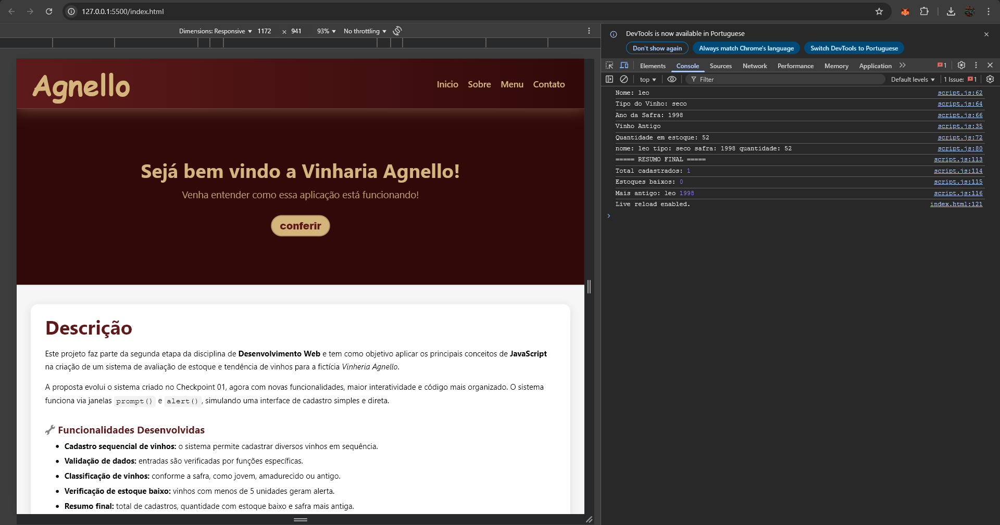

<h1 align="center">🍇 Vinheria Agnello </h1>

Este projeto é o segundo checkpoint da disciplina de Desenvolvimento Web, onde desenvolvemos um sistema de avaliação de estoque e tendência de vinhos utilizando HTML, CSS e JavaScript puro.

<strong>

🔗 Acesse o Projeto: [Agnello | Site](https://cps-fiap-2025.github.io/cp2-WebDev/)
</strong>

## ♦ Descrição do Projeto

Este projeto faz parte da segunda etapa (Checkpoint 02) da disciplina de Desenvolvimento Web e tem como objetivo aplicar conceitos fundamentais de **JavaScript** na criação de um **sistema de avaliação de estoque e tendência de vinhos** para a fictícia *Vinheria Agnello*.

Nesta versão, o sistema foi expandido a partir da lógica inicial criada no Checkpoint 01, e agora permite ao usuário realizar o cadastro de múltiplos vinhos de forma sequencial, por meio da interação com janelas `prompt()` e `alert()` no navegador.

### 💻 Funcionalidades Desenvolvidas

1. **Cadastro de Vinhos:**
   - O sistema solicita via `prompt()` os dados de cada vinho, como nome, safra e quantidade em estoque.
   - Após cada cadastro, o sistema pergunta ao usuário se deseja cadastrar outro vinho, permitindo múltiplas entradas em sequência.

2. **Validação de Dados:**
   - Foram criadas **funções específicas** para validar as entradas fornecidas pelo usuário, garantindo que apenas dados válidos sejam aceitos.

3. **Classificação de Vinhos:**
   - Com base no ano de safra informado, o vinho é classificado em três categorias:
     - **Jovem**: safra recente;
     - **Amadurecido**: safra intermediária;
     - **Antigo**: safra mais distante.
   - A classificação é feita através de uma função reutilizável, que facilita futuras manutenções e ampliações do sistema.

4. **Análise de Estoque:**
   - O sistema verifica, após cada cadastro, se a quantidade do vinho está **abaixo do limite mínimo** (menos de 5 unidades), gerando um aviso ao usuário.

5. **Relatório Final:**
   - Ao finalizar os cadastros, o sistema apresenta um resumo com as seguintes informações:
     - Total de vinhos cadastrados;
     - Número de vinhos com estoque baixo;
     - O vinho com a safra mais antiga cadastrada.

## ♦ Integrantes do Grupo

- Leonardo Da Silva Pinto 564929
- Samuel Enzo D. Monteiro 564391
- Lucas Toledo Cortonezi 563271

## 🎇 Demonstração

